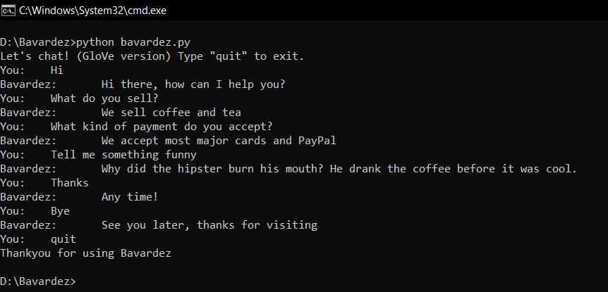

# Bavardez
Building a chatbot from scratch. The bot uses a Bag Of Word for encoding (no word embeddings have been used yet). It uses a simple feed forward neural network to predict labels based on previously given texts. The ability of NLP to learn such simple tasks makes it one of the strongest tools in the field of Artificial/Machine Learning based Chatbots.



## Installation:
Use the following command: 
```
git clone https://github.com/AmanPriyanshu/Bavardez.git
```

## To Execute Bavardez:
Use the command: 
```
python bavardez.py
```

## To add additional Intents/Responses to the same:
Use the command: 
```
python intent_initializer.py
```
The menu for this is self-explanatory allowing most people to use it. 
```python
Enter:
        0. If you wish to initialize all the intents.
        1. If you wish to add another intent.
        2. If you wish to edit one of the intents.
Choice:
```

## To Re-Train the Model:
Use the command: 
```
python train.py
```
## Credits:
The bot is loosely based off of the youtube series [**Chat Bot With PyTorch** by *Python Engineer*](https://www.youtube.com/playlist?list=PLqnslRFeH2UrFW4AUgn-eY37qOAWQpJyg)
